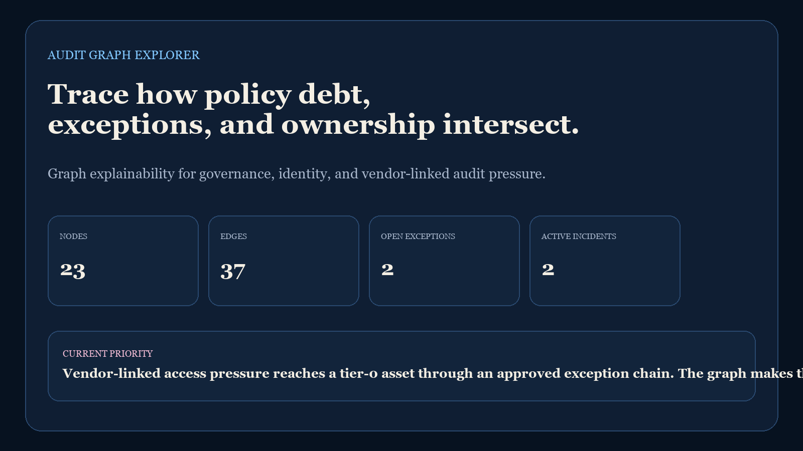
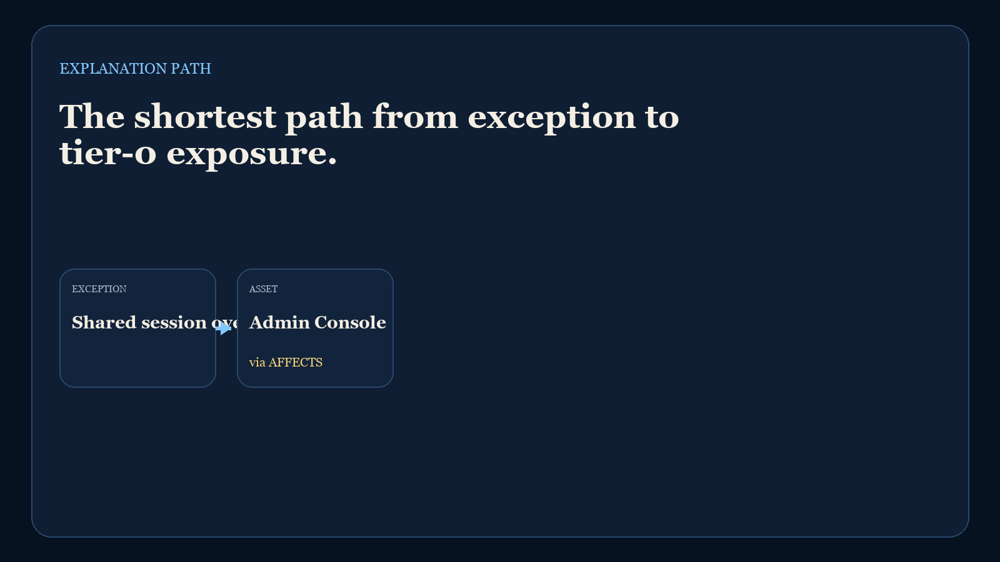
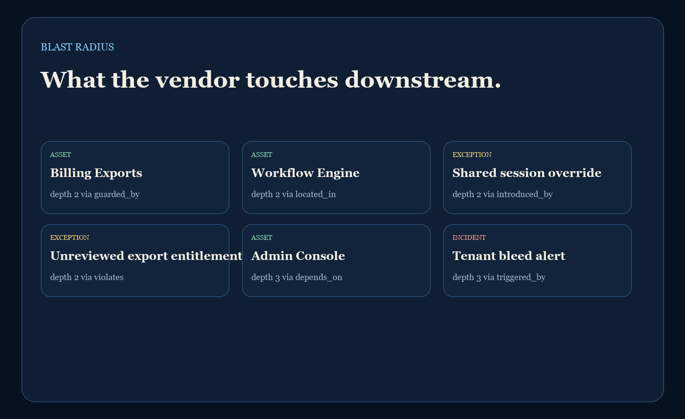
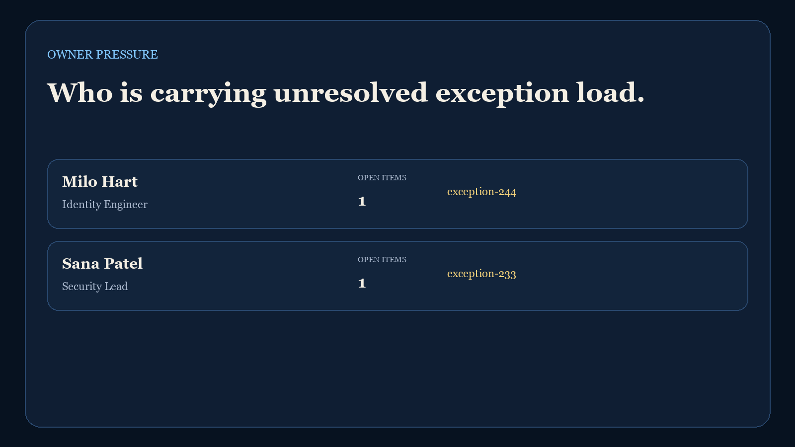

# Audit Graph Explorer

`audit-graph-explorer` is a graph-first governance repo for tracing how exceptions, approvals, incidents, vendors, and assets connect. It pairs a real Neo4j / Cypher graph model with a local Python reporting harness so the project is useful even if Neo4j is not installed yet.

## What It Shows

- Graph modeling for audit, exception, and ownership relationships
- Shortest-path reasoning from policy debt to asset exposure
- Blast-radius exploration from a risky vendor or approval
- Owner-pressure views for unresolved governance items
- Cypher query pack plus local proof screenshots

## Screenshots

### Hero


### Explanation Path


### Blast Radius


### Owner Pressure


## Repo Layout

- [graph/schema.cypher](./graph/schema.cypher): constraints and indexes
- [graph/seed.cypher](./graph/seed.cypher): sample graph load
- [graph/queries.cypher](./graph/queries.cypher): investigation queries
- [data/graph_snapshot.json](./data/graph_snapshot.json): local graph snapshot mirrored from the Cypher seed
- [src/audit_graph_report.py](./src/audit_graph_report.py): shortest-path, blast-radius, and pressure logic
- [scripts/run_demo.py](./scripts/run_demo.py): local report runner
- [scripts/render_readme_assets.py](./scripts/render_readme_assets.py): PNG proof generator
- [docs/architecture.md](./docs/architecture.md): graph design write-up

## Local Validation

### Python report and tests

```powershell
cd audit-graph-explorer
py -3.11 -m pip install -r requirements-dev.txt
py -3.11 scripts\run_demo.py
py -3.11 -m unittest discover -s tests
py -3.11 scripts\render_readme_assets.py
```

### Optional Neo4j load

If you already have Neo4j and `cypher-shell`:

```powershell
cypher-shell -u neo4j -p password -f graph\schema.cypher
cypher-shell -u neo4j -p password -f graph\seed.cypher
cypher-shell -u neo4j -p password -f graph\queries.cypher
```

## Why This Repo Matters

Most audit and governance tooling stops at tables, timelines, or ticket queues. This repo focuses on relationship explainability: how a vendor exception reaches a tier-0 asset, which approval created the path, who owns the unresolved pressure, and which teams are in the blast radius.

That makes it a useful companion to the broader portfolio themes around identity governance, vendor risk, workflow orchestration, and executive control-room reporting.

---

**Connect:** [LinkedIn](https://www.linkedin.com/in/mirzacausevic/) · [Kinetic Gain](https://kineticgain.com) · [Medium](https://medium.com/@mizcausevic/) · [Skills](https://mizcausevic.com/skills/)
